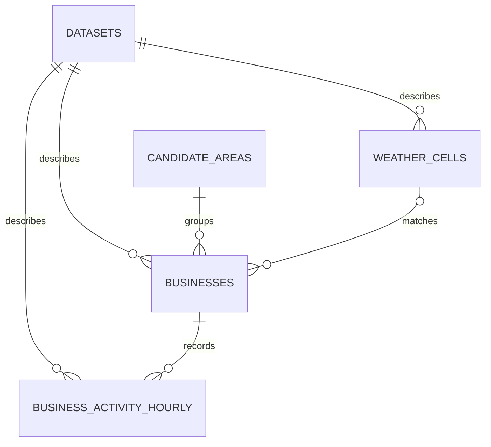

# Basic mockup implementation

Status: confirmed and implemented on 2026-10-10.

## Confirmed scope

- Design first, then implement a runnable minimum version in the current repository.
- Cover the five screens and basic interactions in the [Canva mockup](https://www.canva.com/design/DAHXPFBlPoM/obZM4ewPUKAhHfS3nzDGqg/edit), inspected on 2026-10-10.
- Follow its layout and colors using Streamlit components; exact pixel matching is not required.
- Keep Streamlit, Python, and PostgreSQL. Unavailable sections may use clearly identified mock content.
- Candidate areas use source city/state/ZIP membership. Radius affects only nearby-category business counts around a representative area center; it does not change which businesses supply an area's activity.
- Import Philadelphia, PA; Nashville, TN; and Tampa, FL. Start on Philadelphia with Restaurant and 2015–2021; date controls stay inside the imported historical coverage.
- Limit the application category filter to Restaurant and Spa. Restaurant uses the exact Yelp source category `Restaurants`; Spa uses `Day Spas`, rather than a broader beauty/spa grouping. Keep these source tokens in queries and CSV scope, with the friendly labels in the UI. Reuse the existing import without changing stored categories or reimporting; reset a legacy Coffee & Tea selection to Restaurant.
- Use real business information, check-ins, rating, and activity summaries. Scores, ZIP weather effects, confidence intervals, p-values, ZIP forecasts, review growth, opening counts, and explanatory recommendations are illustrative. Do not train another model.
- Preserve the existing uncommitted research work.

## Observed screen inventory

Shared sidebar: screen navigation, metro area, business category, date range, and data-source information. Ranking also exposes a candidate-area radius.

| Screen | Displayed sections | Basic interactions |
| --- | --- | --- |
| Site ranking | Candidate count, business count, check-in count, weather match rate; scoring weights; candidate map; ranking with score, weekly check-ins, YoY trend, rating, competitors, weather sensitivity; factor contributions and explanation | Change weights/radius, select an area to explain, download ranking CSV; optional local-AI explanation |
| Customer activity | Weekly activity, busiest day, peak hour, seasonality ratio; hour-by-weekday heatmap; monthly seasonality; annual share of metro check-ins; area summary | Select areas and hour/month/year view |
| Weather impact | Event-day count, activity difference, confidence interval, reliability label, weather-match distance; effect-by-event chart, temperature/activity scatterplot, area sensitivity table, method explanation | Select event/area, adjust rainfall threshold and baseline window |
| Demand forecast | Expected check-ins, weekly average/range, disruption difference, baseline comparison; historical/forecast chart; scenario comparison, drivers, model accuracy | Select area, horizon, disruption week and scenario |
| Compare sites | Two to four area cards; dimension scores, monthly seasonality, category review trend, takeaway | Select up to four areas, download comparison CSV |

## Repository facts at design time

- The current app (`app.py` and `src/sitesense/app.py`) is a readiness scaffold with no data pages.
- `sitesense.datasets` stores dataset provenance; business, activity, and weather records are not yet imported. Reuse `src/sitesense/database.py` and append a numbered SQL migration.
- Runtime conventions are Psycopg SQL and Python dataclasses, without an ORM or API service.
- Yelp business records include source ID, address, city/state/postal code, coordinates, category labels, rating, review count, and snapshot operating status.
- Check-ins are per-business timestamp lists without timezone or user/event identifiers. Date/hour interpretation requires an explicit policy; duplicate timestamp entries must not be silently deduplicated.
- Historical Yelp activity ends in January 2022. A historical screen must not label its end date as the current date.
- ERA5 hourly weather and business-to-cell mapping are available. Existing daily weather aggregates use UTC days; joining them to assumed local check-in dates requires a documented conversion policy.
- New station observations and county climate scenarios also exist, but their coverage and time scales differ from historical Yelp activity. They are not interchangeable weather inputs.
- Existing forecast exports describe city/category cohorts, not individual ZIP areas or candidate addresses. Repeating a city forecast for each ZIP would misstate its scope.
- The local review file is a limited prefix sample; category growth and shop-opening counts cannot be presented as complete historical metrics from that sample or from a single business snapshot.

Source references: [Yelp data guide](../../data/README.md), [weather data](../weather-data.md), [database conventions](../database.md).

## Database design

Reuse `sitesense.datasets` for import provenance, add import metadata (coverage dates, cities, source fingerprints and timestamp policy), and add four tables. Raw source archives remain on disk. A single current snapshot is sufficient for this version; the app does not claim historical business status or ratings.

| Table / Python record | Columns and relationships | Keys and checks |
| --- | --- | --- |
| `candidate_areas` / `CandidateArea` | `id`, `city`, `state`, `postal_code`, `display_name`, representative `latitude`, `longitude` | PK `id`; unique `(city, state, postal_code)`; ZIP remains text; coordinates checked when present |
| `weather_cells` / `WeatherCell` | Source `weather_cell_id`, cell coordinates, `dataset_id` | Source ID PK; dataset FK; valid coordinate bounds |
| `businesses` / `Business` | Source `business_id`, `area_id`, name/address/city/state/postal code, coordinates, `categories` text array, stars, review count, snapshot `is_open`, nullable `weather_cell_id`, `dataset_id` | Source ID PK; area/weather/dataset FKs; stars 0–5, nonnegative review count; coordinates checked |
| `business_activity_hourly` / queried as `ActivityRecord` area aggregates | `business_id`, `activity_date`, `hour_of_day`, `checkin_count`, `timestamp_policy`, `dataset_id` | PK `(business_id, activity_date, hour_of_day)`; business/dataset FKs; hour 0–23, positive count; policy explicitly `assumed_source_local` |

Keep `area_id` nullable for missing or unusable ZIP labels. Exclude these businesses from area ranking and show import exclusions in its summary. A five-digit ZIP format is not proof of geographical correctness; preserve the source label without inventing polygons. Display a handful of mockup neighborhood labels as convenient aliases, with the ZIP and source city always visible.

Indexes follow the actual reads: business area membership/category filtering and activity business/date filtering. No PostGIS, ORM, raw check-in event table, customer table, score table, forecast table, or stored AI explanation is required for the confirmed minimum.

### Import and temporal policy

- Provide an explicit import command after the existing migration command; never import or migrate during a Streamlit rerun.
- Read only the three confirmed city/state cohorts. Normalize whitespace/case for city matching and use canonical city/state in area identity and filters. Preserve raw source labels on businesses and report excluded rows.
- Match categories as exact labels in the source comma-separated list; avoid substring matching.
- Aggregate check-in timestamp entries per business/date/hour. Preserve repeated entries and retain sparse positive buckets; fill absent calendar dates with zeros only within imported coverage when calculating averages.
- Interpret source date/hour as unverified local calendar labels, consistent with the current research default. Show that assumption near hourly charts. Philadelphia and Tampa are Eastern; Nashville is Central. No invented UTC offset or verified-timezone claim is attached to source timestamps.
- Import weather-cell metadata and business mappings for the weather-match coverage metric. Label it as spatial mapping coverage, not the percentage of activity dates with valid weather observations.
- Keep actual weather-effect estimation and local-day weather joins outside this version. Daily weather/forecast tables can be added later when a real screen requires them.
- Reimports replace the selected generated cohort within a transaction, preserving unrelated dataset registry records. Use source fingerprints/version information so repeated imports do not multiply activity counts.

## Application design

- Reuse the single application and explicit migration workflow.
- Use typed dataclasses as read models with parameterized Psycopg queries.
- Keep data import, aggregation, UI rendering, and mock fixtures separate.
- Put global filters in the Streamlit entrypoint and use native navigation, metrics, tables, maps, charts, and download buttons.
- Retain raw source files outside PostgreSQL; import only the subset and aggregates required by these screens.
- Use one consistent illustrative assessment per selected area/category and filter configuration across ranking, forecast, comparison, and explanatory text. All illustrative panels and their CSV columns state that their values are mock content.
- Controls in illustrative panels demonstrate simple deterministic transformations of mock values: weight changes recompute an illustrative weighted score, and scenario/horizon/threshold changes update illustrative examples. These are not estimated models. Show real and illustrative values with separate labels.
- When no real activity exists for the selection, show an empty state rather than filling a real metric from an illustrative fixture.

Current documentation: [shared multipage widgets](https://docs.streamlit.io/develop/concepts/multipage-apps/widgets), [Streamlit navigation](https://docs.streamlit.io/develop/api-reference/navigation/st.navigation), [Psycopg row factories](https://www.psycopg.org/psycopg3/docs/api/rows.html), [query parameters](https://www.psycopg.org/psycopg3/docs/basic/params.html).

### Screen-to-data mapping

| Screen | Real read models / basic logic | Illustrative content |
| --- | --- | --- |
| Site ranking | `AreaSummary`: selected-category businesses per area, recorded activity per selected interval, mean snapshot rating, nearby-category count by Haversine distance, spatial weather mapping coverage; map marker at area center | Dimension scores, weighted total, weather sensitivity, factor contributions and advice |
| Customer activity | `ActivitySummary`: hourly/weekday counts, average weekly counts over the full selected calendar interval, weekday/weekend shares, monthly index, annual share of imported city/category check-ins, peak day/hour | Optional explanatory narrative only |
| Weather impact | Real source/mapping identity and distance where available | Event counts, effect percentages, CI, p-value/reliability, effect chart, temperature/activity scatter and method example; sliders change illustrative examples |
| Demand forecast | Selection identity and the selected area's real historical weekly activity | Future weekly series, uncertainty band, scenario effect, forecast drivers and backtest accuracy; the forecast origin is the historical selection end date, not today |
| Compare sites | Reuse the exact `AreaSummary` and monthly summaries used on other screens; enforce at most four areas | Reuse illustrative scores/sensitivity, show review/opening trends and takeaway as illustrative |

`Filters` is a typed application record for city/state, category, date range, and radius. Scoring weights and page-specific area selections use Streamlit session state. Models are frozen dataclasses. Queries stay in one data-access module; aggregation and mock calculations stay separate from page rendering.

### Behavior and safe defaults

- A candidate needs at least five listed businesses matching the selected category. Explain this threshold, and show a useful empty state if no area qualifies.
- Snapshot `is_open` and ratings do not describe historical status; do not silently filter historical activity to currently open businesses.
- Nearby-category counts use the imported city cohort, include every matching listed business in the radius, and do not subtract one: the candidate is an area, not an existing shop. The count is not a complete market census.
- Date controls operate on hourly records, so every activity chart respects the same filters. Shared widgets retain state across navigation; dependent area selections reset when city/category changes.
- Weekly average uses selected calendar days divided by seven. Monthly indices and annual area shares include their denominators; undefined ratios and absent/zero prior-period denominators display `N/A`.
- Real YoY needs the full matching previous period in imported coverage. Missing imported data is not an observed zero.
- Weights are normalized for illustrative scores; all-zero weights produce a validation message. Limit disruption week to the chosen horizon and comparison to two–four areas when available.
- The optional Ollama action only reveals a labeled example explanation. No model download, local-AI dependency or integration is required.
- A missing database configuration, unapplied migration, or empty import shows a recoverable setup/data-unavailable state, without exposing credentials or raw connection errors. Real panels do not silently fall back to fake data.
- CSV downloads describe their scope and mark illustrative fields explicitly.

## Delivery and validation

Implement a new numbered SQL migration, typed records, explicit source import, data-access and summary functions, consistent mock calculations, and five native Streamlit views. Add focused coverage for date-filtered aggregation, preserved duplicate entries, empty/undefined ratios, mock consistency, and migration/import re-run behavior. Test the migrated local PostgreSQL path and the five UI pages where the environment permits.

Run the repository-required `uv run --frozen python scripts/check.py` and `uv run --frozen python scripts/smoke.py`; report database integration separately from headless rendering and HTTP health checks.

### Completed local validation

- Migration `002_basic_app.sql` applied and source data imported into local PostgreSQL: 30,620 businesses, 210 source ZIP areas, and 3,574,448 check-in entries stored in 3,302,387 hourly buckets.
- In an isolated checkout containing this change, the required full `scripts/check.py` command passed: Ruff/formatting, mypy, package build, and all 86 tests, including 11 isolated PostgreSQL integration tests.
- An inherited notebook import-order issue was fixed by removing one blank source line in `notebooks/03_forecasting_model_comparison.ipynb`. Its code AST, outputs, execution counts, and metadata are unchanged.
- The required smoke command passed for HTTP startup, all five native pages, and safe setup states.
- Streamlit AppTest rendered all five pages against the imported database and verified city switches for Philadelphia, Nashville, and Tampa. A live browser check also verified the native layout, charts, and mock labels.

The runnable app uses `models.py`, `import_data.py`, `repository.py`, `analytics.py`, `mock_data.py`, and `ui.py` under `src/sitesense/`, with the five navigation pages under `app_pages/`. Local startup and reimport instructions are in [database setup](../database.md).
